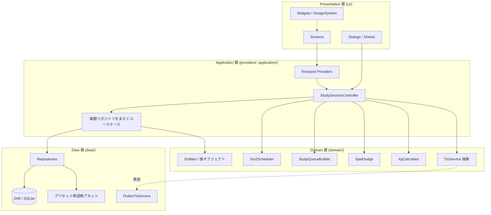
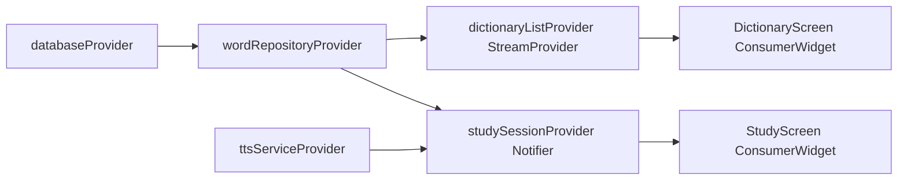
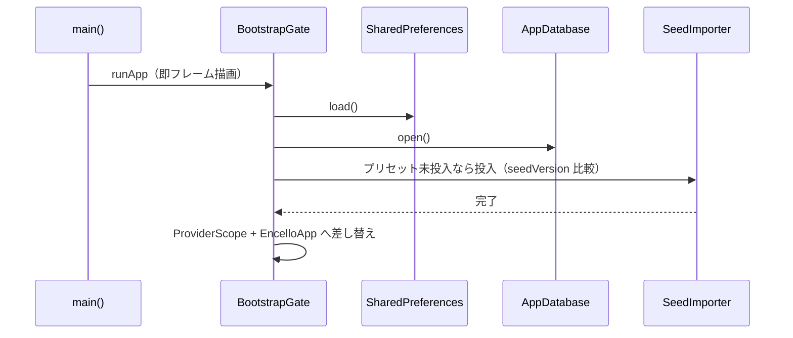

# 02. アーキテクチャ（Architecture）

## 1. レイヤー構成



- **Presentation**: 描画とユーザー入力のみ。状態は Riverpod から受け取る。
- **Application**: Riverpod の Provider / Notifier。学習セッションの進行（現在の問題・解答受付・次へ）と、
  **複数リポジトリにまたがる不可分な書き込み**をここに置く。UI は `AppDatabase.transaction` を直接呼ばない。
- **Domain**: Flutter にも Drift にも依存しない純粋関数・値オブジェクト・外部依存の抽象。
- **Data**: Drift スキーマと DAO、リポジトリ実装、TTS 実装、プリセット単語帳の読み込み。

### 1.1 トランザクション境界

1問の解答は「学習ログの追加」「学習状態の更新」「日次集計の更新」「XP 加算」の4つを同時に満たす必要がある。
これを画面に分散させず、`application/answer_submission_service.dart` の単一メソッドに集約し `db.transaction` で不可分にする。
セッション終了時の「セッション記録の確定」「実績の解除判定」も同様に1つのユースケースにまとめる。

### 1.2 Drift 生成クラスの扱い

`Word` / `Wordbook` / `WordReview` などの Drift 生成クラスは、Data→Application 境界の DTO として正式に採用する。
別途のドメインエンティティへ写像しない。`domain/` は引き続き Drift に依存せず、SM-2 計算などは
`ReviewState`（`repetition` / `intervalDays` / `easeFactor` / `dueAt` を持つ純粋な値オブジェクト）を受け渡す。
リポジトリが `WordReview` ⇄ `ReviewState` を変換する。

## 2. 状態管理（Riverpod）

- `flutter_riverpod` の `ConsumerWidget` / `Notifier` パターン。
- DB・リポジトリ・TTS は Provider で注入し、テストでは `ProviderContainer` の `overrides` で差し替える。
- 辞書一覧など DB を直接見る一覧は Drift の `.watch()` を `StreamProvider` で公開する。
- **学習セッションだけは Stream に載せない**。出題キューはセッション開始時に一度作り、
  `StudySessionController`（`Notifier<StudySessionState>`）がメモリ上で進行を持つ。
  DB 更新のたびに再ビルドされて問題順が変わる事故を構造的に防ぐ。



## 3. 採用パッケージ

Flutter 3.44 / Dart 3.12（`environment: sdk: ^3.12.0`）を前提とする。

| 用途 | パッケージ | 版 | 備考 |
|---|---|---|---|
| 状態管理 / DI | `flutter_riverpod` | ^3.3.2 | 姉妹アプリ共通 |
| DB | `drift` / `drift_dev` | ^2.34.2 | 型安全 ORM・マイグレーションテスト |
| SQLite 本体 | `sqlite3` | ^3.5.0 | v3+ は build hooks で本体を同梱する。`sqlite3_flutter_libs` は EOL のため使わない |
| パス | `path_provider` / `path` | ^2.1.6 / ^1.9.0 | DB ファイルの配置先 |
| 読み上げ | `flutter_tts` | ^4.2.5 | 端末内 TTS。ネットワーク不要 |
| 画面スリープ抑止 | `wakelock_plus` | ^1.7.0 | フラッシュカード自動送り中（NFR-10） |
| フォント | `google_fonts` | ^8.2.0 | Noto Sans JP を**アセット同梱**。ランタイム取得は禁止 |
| 絵文字 | `emoji_picker_flutter` | ^4.5.3 | 単語帳の絵文字選択 |
| 整形 | `intl` | ^0.20.2 | 日付・数値 |
| 多言語 | `flutter_localizations` | sdk | ARB |
| CSV | `csv` | ^8.0.0 | 単語帳の CSV 入出力 |
| 共有 / 書き出し | `share_plus` / `file_selector` | ^13.3.0 / ^1.1.0 | `file_picker` は win32 の制約で `share_plus` 13+ と共存できないため使わない |
| 設定の永続化 | `shared_preferences` | ^2.3.2 | 単純なキー値の設定 |
| ID | `uuid` | ^4.6.0 | セッションIDなど |
| テスト | `flutter_test` / `mocktail` / `integration_test` | sdk / ^1.0.4 | |

### 3.1 グラフを外部パッケージにしない理由

統計画面のドーナツ（習熟度内訳）と棒グラフ（直近30日の学習量）は、pricello の
`DonutChart` / `PriceChart`（`CustomPainter`）を移植する。姉妹アプリと同じ見た目になり、外部依存も増えない。
`fl_chart` は採用しない。

### 3.2 入力に `TextField` を使わない理由

スペル入力は `TextField` ではなく、`ValueNotifier<String>` ＋ 自前の文字タイル表示 ＋ アプリ内キーボードで構成する。
`autocorrect: false` / `enableSuggestions: false` を指定しても、Android の一部 IME は変換候補バーを表示し、
正解がそのまま候補に出てしまう。OS の入力欄を使わないことが、これを確実に防ぐ唯一の方法になる
（[06_features/spell_mode.md] §2）。

## 4. 起動シーケンス

- `main()` は **`runApp` の前で非同期初期化を `await` しない**。プラグイン初期化が停滞したときに
  最初のフレームが描画されず、ネイティブスプラッシュのまま固まるのを防ぐ。
- `runApp(BootstrapGate())` が即座にフレームを描画してスプラッシュを引き継ぎ、その後に次を行う。



- 初期化には **10秒のタイムアウト**を設け、超過・失敗時はエラー内容と再試行ボタンを表示する。
- プリセット単語帳の投入は初回のみ。アセットの `seedVersion` が DB の値より新しいときだけ差分を適用する
  （[06_features/wordbooks.md] §3）。
- フォントは同梱アセットのみを使い、`GoogleFonts.config.allowRuntimeFetching = false` とする。
- TTS の初期化（利用可能な voice の列挙）は**起動をブロックしない**。ホーム表示後に非同期で行い、
  結果を `ttsCapabilityProvider` に流す。voice が無い言語の操作は、判明した時点で非表示になる。

## 5. プロジェクト構成（`encello/lib/`）

```
lib/
├── main.dart                     # runApp + BootstrapGate
├── app.dart                      # MaterialApp / テーマ / l10n / RootShell
├── core/
│   ├── theme/                    # app_colors / app_text / app_spacing
│   ├── l10n/                     # ARB + 生成物
│   └── utils/                    # 文字正規化・日付境界（04:00）・拡張
├── data/
│   ├── database/                 # tables/ dao/ app_database.dart migrations.dart
│   ├── repositories/             # word / wordbook / review / log / stats repository
│   ├── seeds/                    # プリセット単語帳の読み込み（assets/wordbooks/*.json）
│   └── services/                 # flutter_tts_service.dart / export_import_service.dart
├── domain/
│   ├── entities/                 # ReviewState, StudyItem, Mastery, SpellVerdict, TtsCapability
│   ├── services/                 # tts_service.dart（抽象）
│   └── usecases/                 # sm2_scheduler / study_queue_builder / spell_judge
│                                 #   / xp_calculator / choice_distractors / streak_calculator
├── application/                  # answer_submission_service / session_finalizer
│                                 #   / seed_importer / achievement_evaluator
├── providers/                    # Riverpod provider 定義＋境界の純粋集計関数
└── ui/
    ├── screens/                  # home / study / dictionary / word_detail / stats / settings ...
    ├── widgets/                  # SoftCard, EnglishKeyboard, LetterTiles, WordThumb,
    │                             #   DonutChart, BarChart, EmptyState, CenteredContent ...
    └── dialogs/                  # confirm_dialog, upsert_word_sheet, upsert_wordbook_sheet
```

## 6. 依存方向の原則

- 上位層は下位層に依存してよいが、逆は不可（Domain は Presentation / Data 実装を知らない）。
- 外部 I/O（TTS・ファイル）は Domain で**インターフェース**として定義し、Data 層で実装、テストでフェイクを注入する。

```dart
// domain/services/tts_service.dart（抽象）
abstract class TtsService {
  /// 端末で利用できる音声。取得できない場合は空を返す（推測で埋めない）
  Future<TtsCapability> capability();

  /// 読み上げ。完了 or 中断まで待つ。voice が無い言語は TtsUnavailable を投げる
  Future<void> speak(String text, TtsLang lang);

  Future<void> stop();
}
// data/services/flutter_tts_service.dart（実装）
// test/fakes/fake_tts_service.dart（テスト用）
```

## 7. エラー・利用不能状態の扱い

| 状況 | 挙動 |
|---|---|
| 端末に英語 voice が無い | リスニング・スペルモードと読み上げボタンを**非表示**にし、設定 > 学習に理由を1行表示する |
| TTS 再生が失敗した | SnackBar で失敗を示す。フラッシュカードの自動送りは**止める**（無音で進めない） |
| プリセット投入が失敗した | 起動ゲートでエラーと再試行を表示する。空の単語帳でアプリを起動させない |
| インポートの行が壊れている | 取り込まずに行番号と理由を一覧で示す。推測で補完しない |
| DB マイグレーション失敗 | 起動を中断し、エラーとエクスポート手順を表示する。DB を作り直さない |

## 8. SDK / 最低OS

- Flutter 安定版 3.44 系 / Dart 3.12。
- Android `minSdkVersion 26`（Android 8.0）、`compileSdk` は最新安定。
- iOS Deployment Target `13.0`。詳細は [08_platform_setup.md]。
