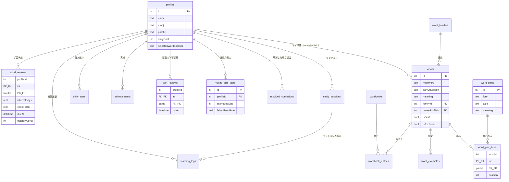

# 03. データモデル（Data Model）

Drift（SQLite）で端末内に保存する。`schemaVersion = 2`。

1台の端末を複数人で使うため、**単語そのものは全員で共有し、学習の記録は人ごとに分ける**
（[06_features/profiles.md]）。学習設定・表示設定も `profiles` の列に持ち、
`SharedPreferences` には端末レベルの値だけを残す（§8）。

## 1. ER 図



## 2. テーブル定義

### 2.1 `profiles`（学習者）

列の一覧は [06_features/profiles.md] §2 が正本。要点だけ再掲する。

- 識別（`name` / `emoji` / `colorSeed`）
- 表示設定（`palette` / `textScale` / `density` / `dictViewMode` / `dictGridColumns` / `searchExamples`）
- 学習設定（`dailyGoal` / `sessionSize` / `keyboardLayout` / `autoNextOnCorrect` /
  `flashcardMode` / `flashcardSeconds` / `choiceDirection` / `speedLimitMs` / `selectedWordbookIds`）
- 音声設定（`audioSource` / `audioPackIds` / `ttsEnVoice` / `ttsJaVoice` / `ttsRate` / `ttsPitch`）
- リマインダー（`reminderEnabled` / `reminderHour` / `reminderMinute`）

行が1件も無い状態は許さない。最初のプロファイルは初回起動時に作らせる。

### 2.2 `wordbooks`（単語帳）

| 列 | 型 | 制約 | 説明 |
|---|---|---|---|
| `id` | int | PK, autoIncrement | |
| `name` | text | not null | 表示名（例「中学英単語」） |
| `emoji` | text | not null | 一覧サムネの絵文字 |
| `colorSeed` | int | not null | 識別色の割当シード |
| `category` | text | not null | `juniorHigh` / `highSchool` / `eiken` / `toeic` / `myWords` / `custom` |
| `source` | text | not null | `preset` / `user` / `imported` |
| `presetId` | text | nullable, unique | `source = preset` のときアセット側の識別子（例 `jhs_v1`） |
| `ownerProfileId` | int | nullable, FK | マイ単語帳の持ち主。それ以外は null |
| `seedVersion` | int | not null, default 0 | 投入済みプリセットの版 |
| `bandSize` | int | nullable | 語彙力測定で帯として使うときの語数（[06_features/vocab_size_test.md] §3） |
| `note` | text | nullable | 説明文 |
| `sortOrder` | int | not null | 一覧の並び |
| `createdAt` / `updatedAt` | datetime | not null | |

マイ単語帳（`category = myWords`）はプロファイル作成時に自動で作り、削除できない。

### 2.3 `words`（単語）

単語は**単語帳に属さない独立したマスタ**にする。同じ語が複数の単語帳に載っていても実体は1つで、
学習状態も（プロファイルごとに）1つになる。

| 列 | 型 | 制約 | 説明 |
|---|---|---|---|
| `id` | int | PK, autoIncrement | |
| `headword` | text | not null, index | 見出し語。小文字で正規化して保存 |
| `partOfSpeech` | text | not null | `noun` / `verb` / `adjective` / `adverb` / `preposition` / `conjunction` / `pronoun` / `interjection` / `phrase` / `unknown` |
| `phonetic` | text | nullable | 発音記号 |
| `meaning` | text | not null | 日本語訳。`isDraft = true` のときだけ空文字を許す |
| `partsNote` | text | nullable | 語のつくりの説明1行（[06_features/word_parts.md] §3.1） |
| `confusionNote` | text | nullable | 取り違えやすい語との区別の覚え方 |
| `familyId` | int | nullable, FK, index | 派生語ファミリー |
| `level` | int | not null, default 1 | 難易度 1〜5 |
| `frequencyRank` | int | nullable | 頻度順位。持てる語にだけ入れる（§7） |
| `presetId` | text | nullable, index | プリセット由来ならアセット内の識別子 |
| `ownerProfileId` | int | nullable, FK, index | マイ単語の持ち主。共有の語は null |
| `isDraft` | bool | not null, default false | 訳が未入力のマイ単語 |
| `isEdited` | bool | not null, default false | プリセット語をユーザーが編集した |
| `isExcluded` | bool | not null, default false | 出題から除外 |
| `createdAt` / `updatedAt` | datetime | not null | |

- **一意制約**: `UNIQUE(headword, partOfSpeech, ownerProfileId)`。
  共有の語（`ownerProfileId = null`）は全体で1つ。
  マイ単語は人ごとに独立するので、兄と弟が同じ語を登録すれば2行になる
  （[06_features/my_words.md] §2）。
- **プリセット語の復帰**: 編集前の値を DB に二重に持たず、`presetId` でアセットを引き直して戻す。
- 例文は `words` に持たない。`word_examples` に分ける（§2.4）。

### 2.4 `word_examples`（例文）

同じ語でも、載っている単語帳によって適切な例文は違う。
`contract` は TOEIC ならビジネスの文、高校英単語なら一般的な文が読みやすい。
一方で**語そのものは1行のまま**にしないと、学習状態が単語帳ごとに割れてしまう（§2.3）。
そこで語は1行、例文だけを1対多にする。

| 列 | 型 | 制約 | 説明 |
|---|---|---|---|
| `id` | int | PK, autoIncrement | |
| `wordId` | int | not null, FK → `words.id`（cascade delete）, index | |
| `exampleEn` | text | not null | 英語例文（マイ単語では「見つけた文」） |
| `exampleJa` | text | not null | 例文の和訳。**空を許さない**。例文があるなら必ず対で持つ |
| `sourcePresetId` | text | nullable | どの単語帳由来か（`toeic_basic_v1` など）。ユーザーが書いた文は null |
| `sortOrder` | int | not null | 表示順。**ユーザーが書いた文は 0、プリセット由来は `wordbooks.sortOrder`**（易→難） |

- **一意制約**: 部分ユニークインデックスを2本張る。
  `UNIQUE(wordId, sourcePresetId) WHERE source_preset_id IS NOT NULL` と
  `UNIQUE(wordId) WHERE source_preset_id IS NULL`。
  1本の `UNIQUE(wordId, sourcePresetId)` にしないのは、SQLite の UNIQUE が NULL 同士を
  別物として扱い、ユーザーの文が同じ語に何本でも入ってしまうため（`words` と同じ理由）。
- **`sortOrder` の決め方**: ユーザーが自分で見つけた文を先頭に置き、
  そのあとをやさしい単語帳の順に並べる。自分で書いた文はその人にとって文脈があり、
  プリセットの例文より思い出す手がかりになるため。
  値は単語帳の `sortOrder` をそのまま使う（`jhs_v1` = 10 … `toeic_basic_v1` = 60）ので、
  単語帳を足しても採番をやり直さなくてよい。
- **投入**: `SeedImporter` は `(wordId, sourcePresetId)` で upsert する。
  これにより**単語帳をまたいでも例文が互いを上書きしない**
  （この設計にする前は、`words` の単数列を最後に投入した単語帳が上書きしていた）。
- **表示**:
  - 単語詳細画面は全件を並べ、どの単語帳の例文かを添える。
  - 学習画面は**学習中の単語帳の例文**を選ぶ。無ければ `sortOrder` の先頭。
- `meaning` `phonetic` `level` は語の属性なので `words` に1つだけ持つ。
  単語帳ごとに違う値を持たせない（同じ語の訳や難易度が単語帳で変わるのはおかしい）。
  ソースデータ側で単語帳をまたいで一致させ、検証で守る
  （[06_features/wordbooks.md] §3.3）。

### 2.5 `wordbook_entries`（所属）

| 列 | 型 | 制約 |
|---|---|---|
| `wordbookId` | int | PK, FK → `wordbooks.id`（cascade delete） |
| `wordId` | int | PK, FK → `words.id`（cascade delete） |
| `sortOrder` | int | not null。単語帳内の並び |

`wordId` に単独インデックスを張る（単語→所属単語帳の逆引き用）。

### 2.6 `word_reviews`（学習状態）

| 列 | 型 | 制約 | 説明 |
|---|---|---|---|
| `profileId` | int | PK, FK → `profiles.id`（cascade delete） | |
| `wordId` | int | PK, FK → `words.id`（cascade delete） | |
| `repetition` | int | not null, default 0 | 連続正解回数（SM-2 の n） |
| `intervalDays` | real | not null, default 0 | 現在の出題間隔（日） |
| `easeFactor` | real | not null, default 2.5 | 容易度係数。下限 1.3 |
| `dueAt` | datetime | not null | 次回出題日時 |
| `lastReviewedAt` / `firstLearnedAt` | datetime | nullable | |
| `lapses` / `correctStreak` | int | not null, default 0 | |
| `totalCorrect` / `totalIncorrect` | int | not null, default 0 | |
| `masteryLevel` | int | not null, default 0 | 0 未学習 / 1 学習中 / 2 定着 / 3 マスター |

- インデックス: `(profileId, dueAt)` と `(profileId, masteryLevel)`。
  絞り込みは必ずプロファイルとの複合で行うため、単独インデックスにしない。
- `masteryLevel` は導出値だが列として持つ（習熟度での絞り込み・並べ替えにインデックスが要る）。
  導出は `Mastery.from(ReviewState)` 1か所だけが行い、同一トランザクションで必ず一緒に書き換える。
- 行は**初めてその単語を解いたときに作る**。未学習語には行が無い。

### 2.7 `part_reviews`（語の部品の学習状態）

| 列 | 型 | 制約 |
|---|---|---|
| `profileId` | int | PK, FK（cascade delete） |
| `partId` | int | PK, FK → `word_parts.id`（cascade delete） |
| `repetition` / `intervalDays` / `easeFactor` / `dueAt` / `lastReviewedAt` / `correctStreak` / `totalCorrect` / `totalIncorrect` / `masteryLevel` | | `word_reviews` と同じ |

`word_reviews` と同じ形にすることで、同一の `Sm2Scheduler` と `Mastery` を使い回す。

### 2.8 `learning_logs`（解答履歴）

| 列 | 型 | 制約 | 説明 |
|---|---|---|---|
| `id` | int | PK, autoIncrement | |
| `profileId` | int | not null, FK, index | |
| `sessionId` | text | not null, FK → `study_sessions.id`, index | |
| `wordId` | int | nullable, FK → `words.id`（cascade delete）, index | 語のつくりモードでは null |
| `partId` | int | nullable, FK → `word_parts.id` | 語のつくりモードでのみ非 null |
| `mode` | text | not null | `spell` / `listening` / `flashcard` / `choice` / `speed` / `parts` / `family` / `confusion` |
| `direction` | text | not null | `enToJa` / `jaToEn` |
| `isCorrect` | bool | not null | |
| `grade` | int | not null | SM-2 に渡した grade（0〜5）。`-1` = 学習状態を更新しなかった（時間切れ等） |
| `answeredText` | text | nullable | 入力した文字列／選んだ選択肢。取り違え検出に使う |
| `hintUsed` | int | not null, default 0 | 開示したヒント文字数 |
| `replayCount` | int | not null, default 0 | 音声の再生回数 |
| `elapsedMs` | int | not null | 出題表示から解答確定までの時間 |
| `answeredAt` | datetime | not null, index | |

`wordId` と `partId` はどちらか一方だけが非 null になる。
両方 null、または両方非 null の行は作らない（リポジトリで保証する）。

### 2.9 `study_sessions`（セッション）

| 列 | 型 | 制約 | 説明 |
|---|---|---|---|
| `id` | text | PK | UUID v4 |
| `profileId` | int | not null, FK, index | |
| `mode` | text | not null | |
| `wordbookIds` | text | not null | 対象単語帳の id を JSON 配列で（履歴の再現用） |
| `startedAt` | datetime | not null, index | |
| `finishedAt` | datetime | nullable | null = 中断のまま終わった |
| `plannedCount` / `answeredCount` / `correctCount` / `xpEarned` | int | not null, default 0 | |
| `avgReactionMs` | int | nullable | スピードモードでのみ。時間内正解のみの平均 |

### 2.10 `daily_stats`（日次集計）

| 列 | 型 | 制約 | 説明 |
|---|---|---|---|
| `profileId` | int | PK, FK（cascade delete） | |
| `studyDate` | text | PK | `YYYY-MM-DD`。§6 の日付境界で決める |
| `answeredCount` / `correctCount` / `xp` / `studySeconds` | int | not null, default 0 | |
| `goalCount` | int | not null | その日に適用されていた目標（後から変えても過去を動かさない） |
| `goalMet` | bool | not null, default false | 達成した時点で true。以後 false に戻さない |

`learning_logs` から毎回集計せず、解答と同一トランザクションで積み上げる。

### 2.11 `vocab_size_tests`（語彙力測定）

| 列 | 型 | 説明 |
|---|---|---|
| `id` | int | PK |
| `profileId` | int | FK, index |
| `takenAt` | datetime | index |
| `estimatedSize` | int | 推定語彙数 |
| `falseAlarmRate` | real | 擬似語に「わかる」と答えた率 |
| `bandResults` | text | 帯ごとの補正済み正答率と出題数を JSON で |
| `askedWordIds` | text | 出題した実在語の id（次回の重複回避用）を JSON で |

### 2.12 `audio_packs` / `word_audios`（音声パック）

[06_features/pronunciation.md] §3.1 が正本。

- `audio_packs`: `id` / `packId`（UNIQUE）/ `name` / `source`（bundled・imported）/ `lang`（en・ja）/
  `note?` / `entryCount` / `installedAt` / `sortOrder`。
- `word_audios`: `id` / `wordId`（FK, cascade）/ `packId`（FK, cascade）/ `lang` / `filePath`。
  `UNIQUE(wordId, packId, lang)`、`(wordId, lang)` にインデックス。

**`profileId` を持たない**。音声は単語の属性であって学習の記録ではないため、
`words` と同じく学習者間で共有する。どのパックを使うかの選択と音源の優先順位だけを
`profiles` の列（`audioSource` / `audioPackIds`）に持つ。

### 2.13 `word_parts` / `word_part_links`

[06_features/word_parts.md] §2 が正本。

- `word_parts`: `id` / `form` / `type`（prefix・root・suffix）/ `meaning` / `origin?` / `note?` / `level`。
  `UNIQUE(form, type)`。
- `word_part_links`: `wordId` / `partId`（複合PK）/ `position`。`partId` に単独インデックス。

### 2.14 `word_families`

| 列 | 型 | 説明 |
|---|---|---|
| `id` | int | PK |
| `baseForm` | text | 語族の代表形。UNIQUE |
| `note` | text? | 補足 |

所属は `words.familyId` で表す。

### 2.15 `resolved_confusions`（解消した取り違え）

| 列 | 型 | 説明 |
|---|---|---|
| `profileId` | int | PK, FK（cascade delete） |
| `wordIdA` / `wordIdB` | int | PK, FK。**必ず `wordIdA < wordIdB` で正規化して保存する**（向きを持たせない） |
| `resolvedAt` | datetime | |

### 2.16 `achievements`（実績）

| 列 | 型 | 制約 |
|---|---|---|
| `profileId` | int | PK, FK（cascade delete） |
| `code` | text | PK（例 `streak_7`、`mastered_100`） |
| `unlockedAt` | datetime | not null |

解除条件は `application/achievement_evaluator.dart` に定義し、DB には解除済みだけを残す。

## 3. インデックス方針

| 対象 | 目的 |
|---|---|
| `words.headword` | 辞書の英語検索・前方一致 |
| `words.ownerProfileId` | 自分のマイ単語の絞り込み |
| `words.familyId` | 語族の取得 |
| `words.presetId` | プリセット差分適用・復帰 |
| `word_reviews (profileId, dueAt)` | 「今日の復習」の抽出 |
| `word_reviews (profileId, masteryLevel)` | 習熟度フィルタ・ソート |
| `part_reviews (profileId, dueAt)` | 語のつくりモードのキュー |
| `wordbook_entries.wordId` | 単語→所属単語帳の逆引き |
| `word_part_links.partId` | 部品→単語の逆引き |
| `word_audios (wordId, lang)` | 音源の解決（再生のたびに引く） |
| `learning_logs (profileId, answeredAt)` | 直近30日の集計・取り違え検出 |
| `learning_logs.wordId` | 単語詳細の履歴 |
| `study_sessions (profileId, startedAt)` | 履歴一覧 |

日本語訳の検索は `meaning LIKE '%…%'` で中間一致するためインデックスが効かない。
1万語でも全走査が数ミリ秒で終わる規模なので FTS は導入しない。
10万語規模を扱うことになった時点で FTS5 を検討する。

## 4. 集計の前提: プロファイルを必ず条件に入れる

学習に関わるすべてのクエリは `profileId` を条件に含める。
リポジトリのメソッドは `profileId` を**必須引数**にし、既定値を持たせない。
「現在のプロファイル」をリポジトリ内部で参照すると、
テストや一括処理で意図しないプロファイルのデータを触る事故が起きる。

## 5. 単語の可視範囲

辞書・キュー生成・統計で対象にする単語は次の条件を満たすもの。

```sql
words.ownerProfileId IS NULL OR words.ownerProfileId = :profileId
```

出題対象はさらに `isExcluded = false AND isDraft = false` を加える。

## 6. 日付の境界

学習日は**端末ローカル時刻の 04:00 区切り**とする。
深夜1時の学習を前日の続きとして数え、ストリークが理不尽に切れないようにするため。

```dart
// core/utils/study_date.dart
String studyDateOf(DateTime local) {
  final shifted = local.subtract(const Duration(hours: 4));
  return DateFormat('yyyy-MM-dd').format(shifted);
}
```

`daily_stats.studyDate`・ストリーク計算・「今日の復習」の判定は、すべてこの関数を通す。
`dueAt` の比較だけは実時刻で行う（間隔反復は暦日ではなく経過時間で決まるため）。

## 7. `frequencyRank` の扱い

語彙力測定は**級帯（単語帳）単位**で行うため、頻度順位が無くても成立する
（[06_features/vocab_size_test.md] §3）。

`frequencyRank` は次の用途のために列だけを用意し、値を持てる語にだけ入れる。

- 辞書のソート項目「頻度順」
- 新規出題の順序を掲載順ではなく頻度順にする設定

公開されている頻度リスト（NGSL 等）を同梱する場合は、**ライセンス条件を確認してから**行う。
確認が取れないうちは、この列は null のままにし、頻度順のソート項目自体を表示しない。

## 8. `SharedPreferences` に置く値

学習者ごとの設定は `profiles` の列に持つため、prefs に残すのは端末レベルの値だけ。

| キー | 型 | 既定 | 説明 |
|---|---|---|---|
| `profile.lastActiveId` | int | なし | 前回使ったプロファイル |
| `seed.installedVersion` | int | `0` | プリセットの投入済み版 |

## 9. マイグレーション

- `schemaVersion` で管理する。
  - **未整備**: 「`drift_dev` が生成するスキーマスナップショットに対して各版のテストを書く」と
    決めてあるが、`drift_schemas/` はまだ無い。`schemaVersion = 2` への移行は
    v1 相当の DDL を手で組んだ DB に対して確認した。M9 でスナップショットを導入する。
- 破壊的変更（列の削除・型変更）は行わず、追加と移行で対応する。
  - **例外**: まだ配信していない版に限り、破壊的変更を許す。
    この方針は出荷済みの端末にあるデータを守るためのもので、守る対象が存在しないうちは、
    使わない列を残す方が設計を濁す。
    `schemaVersion = 2` で `words.exampleEn` / `exampleJa` を削除し `word_examples` に移したのが該当
    （§2.4）。配信後はこの例外を使わない。
- マイグレーションに失敗したら起動を中断し、エラーとエクスポート手順を表示する。DB を作り直さない。

## 10. エクスポート形式

JSON（`formatVersion: 1`）。詳細は [06_features/export_import.md]。

```json
{
  "formatVersion": 1,
  "appVersion": "1.0.0",
  "exportedAt": "2026-08-04T12:34:56+09:00",
  "profiles": [
    {
      "name": "たろう", "emoji": "🦊", "palette": "blue", "dailyGoal": 20,
      "reviews": [ { "headword": "apple", "partOfSpeech": "noun", "repetition": 3, "intervalDays": 16.0, "easeFactor": 2.6, "dueAt": "..." } ],
      "partReviews": [ { "form": "port", "type": "root", "repetition": 2, "..." : "..." } ],
      "logs": [ ... ],
      "dailyStats": [ ... ],
      "achievements": [ ... ],
      "vocabSizeTests": [ ... ],
      "resolvedConfusions": [ { "a": {"headword": "affect", "partOfSpeech": "verb"}, "b": {"headword": "effect", "partOfSpeech": "noun"} } ],
      "myWords": [ ... ]
    }
  ],
  "wordbooks": [ { "presetId": "jhs_v1", "name": "中学英単語", "emoji": "🏫", "category": "juniorHigh", "words": ["apple:noun", "..."] } ],
  "words": [ { "headword": "apple", "partOfSpeech": "noun", "meaning": "りんご", "phonetic": "/ˈæpl/", "familyBase": null, "parts": [], "examples": [ { "en": "I ate an apple for breakfast.", "ja": "朝食にりんごを食べました。", "sourcePresetId": "jhs_v1" } ] } ],
  "wordParts": [ { "form": "port", "type": "root", "meaning": "運ぶ" } ],
  "wordFamilies": [ { "baseForm": "decide" } ]
}
```

- 単語の参照は数値 id ではなく `headword` + `partOfSpeech` で行う。別端末で id が一致しないため。
- プロファイルは `name` で解決する。同名が無ければインポート時に作る。
- 語の部品は `(form, type)`、語族は `baseForm` で解決する。
- 例文は `words[].examples` に全件入れる（§2.4）。`sourcePresetId` はそのまま持ち回る。
- CSV エクスポートは単語帳単位で
  `headword,partOfSpeech,phonetic,meaning,exampleEn,exampleJa,level` の7列。学習状態は含まない。
  **1語1行なので例文は1つだけ出す**。出すのは**その単語帳の例文**（無ければ `sortOrder` の先頭）。
  CSV で取り込んだ例文は `sourcePresetId = null` で入る（取り込み先はユーザー単語帳のため）。
