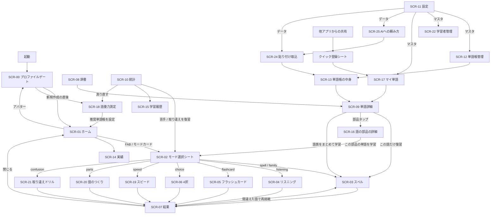
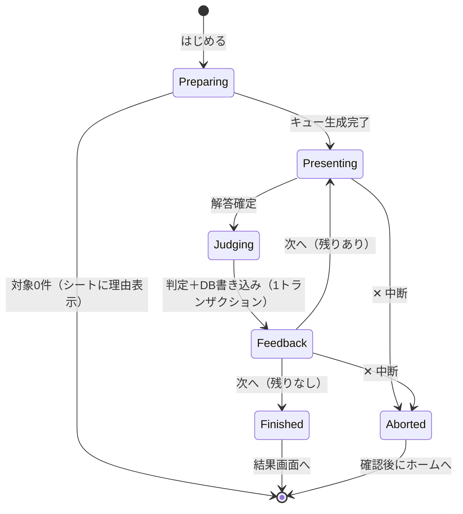

# 04. 画面とフロー（Screens & Flows）

すべての画面は [../../Docs/STYLE_GUIDE.md] の型に従う。本書は encello 固有の中身だけを定める。

## 1. シェル

`Scaffold` + `NavigationBar` の **4タブ**。最後は設定（[STYLE_GUIDE §2]）。
画面幅 840px 以上では `NavigationRail` に切り替える。中央は `CenteredContent`（最大幅640）。

| タブ | アイコン | 画面 |
|---|---|---|
| ホーム | `home_outlined` / `home` | SCR-01 |
| 辞書 | `menu_book_outlined` / `menu_book` | SCR-08 |
| 統計 | `insights_outlined` / `insights` | SCR-10 |
| 設定 | `settings_outlined` / `settings` | SCR-11 |

シェル共通 FAB =「学習をはじめる」（`accent`・角丸18）。押すとモード選択シート（SCR-02）を開く。
期限到来の復習がある間は FAB に `Badge` で件数を出す。

## 2. 画面一覧

| ID | 画面 | 役割 |
|---|---|---|
| SCR-00 | プロファイルゲート | だれが学習するかを選ぶ。学習者が2人以上のときだけ出る |
| SCR-01 | ホーム | 今日の進捗・復習件数・ストリーク・モード別クイックスタート |
| SCR-02 | モード選択シート | モード / 単語帳 / 問題数 を決めてセッションを開始する |
| SCR-03 | スペル学習 | 和訳→綴り。アプリ内キーボード。語形変化クイズもここに含む |
| SCR-04 | リスニング・スペル | 音声→綴り。アプリ内キーボード |
| SCR-05 | フラッシュカード | 3種の自動送り |
| SCR-06 | 4択クイズ | EN→JA / JA→EN |
| SCR-07 | セッション結果 | 成績・獲得XP・間違えた語・再挑戦 |
| SCR-08 | 辞書 | 全単語の検索・絞り込み・並べ替え |
| SCR-09 | 単語詳細 | 語の情報・語のつくり・語族・学習状態・履歴 |
| SCR-10 | 統計 | 習熟度内訳・学習量推移・苦手単語・取り違え・反応時間・語彙力推移 |
| SCR-11 | 設定 | 5タブ（表示 / 学習 / マスタ / データ / 情報） |
| SCR-12 | 単語帳管理 | 単語帳の追加・編集・削除・選択 |
| SCR-13 | 単語帳の中身 | 収録単語の一覧・追加・除外 |
| SCR-14 | 実績 | バッジ一覧（解除済み / 未解除） |
| SCR-15 | 学習履歴 | 過去セッションの一覧 |
| SCR-16 | 語の部品の詳細 | 接頭辞・語根・接尾辞の意味と、その部品を含む単語 |
| SCR-17 | マイ単語 | 自分が登録した単語の一覧・下書きの整備 |
| SCR-18 | 語彙力測定 | Yes/No 方式のテストと結果 |
| SCR-19 | スピード学習 | 制限時間つき4択を50問連続 |
| SCR-20 | 語のつくり学習 | 部品の意味と、部品からの意味推測 |
| SCR-21 | 取り違えドリル | 混同している2語を並べて区別させる |
| SCR-22 | 学習者管理 | 学習者の追加・編集・削除 |
| SCR-23 | 音声パック管理 | 音声パックの取り込み・使用切替・優先順位・削除 |
| SCR-24 | 貼り付け取込 | AI に作ってもらった単語帳を貼り付けて取り込む |
| SCR-25 | AI への頼み方 | 単語帳を作ってもらう定型文のコピー |

## 3. 遷移



## 4. 主要画面のレイアウト

### 4.1 SCR-01 ホーム

上から順に `SoftCard` を積む。

画面右上に**現在の学習者のアバター**（絵文字＋名前）を置く。タップで SCR-00 へ戻り切り替える。
学習者が1人だけのときも表示する（自分の色と絵文字が見えることに意味がある）。

1. **今日のカード**
   - 左に円形プログレス（`CustomPainter`。`answeredCount / goalCount`）、中央に「12 / 20 問」。
   - 右にストリーク `🔥 7日`。ストリークが 0 のときは炎を出さず「今日から始めましょう」と表示する。
   - 下部に `FilledButton`「今日の復習 23語をはじめる」。復習が 0 件なら
     「新しい単語を学ぶ」に文言が変わる（ボタンを消さない）。
2. **モードカード（グリッド）**
   - スペル ✏️ / リスニング 🎧 / フラッシュカード 🃏 / 4択 🎯 /
     スピード ⚡ / 語のつくり 🧩 / 語形変化 🔤 / 取り違え 🔀。
   - タップで SCR-02 をそのモードで開く。
   - **利用できないモードはカードごと非表示**にする（[STYLE_GUIDE §0-4]）。
     英語 voice が無ければリスニング、学習済みが20語未満ならスピード、
     取り違えの組が0件なら取り違え、部品の紐付けが無ければ語のつくり、が消える。
   - 学習を始めたばかりの人には4枚しか出ない。進むにつれてカードが増える。
     使えないモードを先に見せて期待させない。
3. **直近の成績カード**: 直近7日の正解率と学習語数。タップで SCR-10 へ。
4. **語彙力カード**: 最後の測定結果（推定語彙数と、次に取り組む単語帳）。
   30日以上測っていなければ「語彙力を測り直しませんか」に変わる。閉じられる。
5. **下書きカード**: マイ単語の下書きが3語以上あるとき「訳が空の単語が5語あります」。
   タップで SCR-17 の下書き整備へ。0〜2語のときは出さない。
6. **未達の実績カード**: 次に解除できる実績を1つだけ出し、達成条件と進捗を表示する。タップで SCR-14 へ。

初回起動（単語帳未選択）は 1〜6 の代わりに `EmptyState`「学習する単語帳を選びましょう」＋
`FilledButton`「語彙力を測ってレベルに合う単語帳を選ぶ」（SCR-18 へ）と
`OutlinedButton`「自分で単語帳を選ぶ」（SCR-12 へ）を出す。

### 4.2 SCR-02 モード選択シート

`showModalBottomSheet(isScrollControlled: true)`、角丸24。

```
学習をはじめる                              (sectionTitle)
モード      [ スペル ▾ ]                    ← DropdownButtonFormField
単語帳      [ 中学英単語 ほか2冊 ▾ ]         ← 複数選択（タップで選択シート）
問題数      [ 10 | 20 | 50 | 全部 ]          ← SegmentedButton
出題        [ 復習優先 | 新規のみ | 苦手のみ ] ← SegmentedButton
                                            (モードにより行が増減)
[ はじめる ]                                ← FilledButton / minimumSize(48)
```

- 「はじめる」を押した時点で出題キューを作る（[06_features/srs_scheduler.md] §3）。
- キューが空（対象語が0件）のときはシートを閉じず、理由を1行表示する
  （「選んだ単語帳に出題できる語がありません」）。空のセッションを開始しない。
- モードのプルダウンには**そのとき使えるモードだけ**を並べる。
  スピード（学習済み20語以上）・取り違え（組が1件以上）・語のつくり（部品の紐付けあり）・
  語形変化（条件を満たす語族あり）は、条件を満たさなければ選択肢に出ない。
- スピードモードでは「問題数」の行が消え、代わりに「制限時間 2 / 3 / 5秒」が出る。
- 取り違えドリルでは「単語帳」「出題」の行が消える（対象は自分の取り違えの組に限られるため）。

### 4.3 SCR-03 スペル学習 / SCR-04 リスニング・スペル

全画面（`Scaffold`、`AppBar` なし。上部に自前の進捗バー）。

```
┌──────────────────────────────────┐
│ ✕        ●●●●○○○○○○  4/10        │  中断 / 進捗ドット
├──────────────────────────────────┤
│                                  │
│        [名詞]                    │  品詞バッジ
│        りんご                    │  和訳（SCR-04 では 🔊 再生ボタン）
│                                  │
│      a  p  p  _  _               │  LetterTiles（入力済み / 未入力）
│                                  │
│      ヒント(1)      わからない     │
├──────────────────────────────────┤
│  q w e r t y u i o p             │  EnglishKeyboard
│   a s d f g h j k l              │
│    z x c v b n m   ⌫             │
│         [ 答え合わせ ]            │
└──────────────────────────────────┘
```

- キーボードは画面下部に固定し、上のコンテンツは残りの高さで `SingleChildScrollView`。
  端末の IME は一度も出ないため `viewInsets` を考慮する必要がない。
- 解答確定後は同じ画面にフィードバック帯が下から重なる（画面遷移しない）。

| 判定 | 帯の色 | 内容 |
|---|---|---|
| 正解 | `greenish` | `apple /ˈæpl/` ＋ 自動読み上げ ＋ 例文 ＋「次へ」 |
| 惜しい（編集距離1） | `warning` | 「惜しい: `aple` → `apple`」＋ 差分文字を強調 ＋ 例文 ＋「次へ」 |
| 不正解 | `danger` | 正解の綴りと例文 ＋「次へ」 |

「次へ」は自動では進めない。読む時間を奪わないため、必ずタップで進む。
ただし正解時のみ、設定「正解したら自動で次へ」（既定 OFF）で 1.2 秒後の自動送りにできる。

### 4.4 SCR-05 フラッシュカード

```
┌──────────────────────────────────┐
│ ✕      ●●●○○○  3/20      ⏸ 一時停止 │
├──────────────────────────────────┤
│                                  │
│           りんご                  │  上段（モードにより言語が入れ替わる）
│         ─────────                 │
│           apple                  │  下段
│          /ˈæpl/                  │
│                                  │
│  ◀ 戻る          🔊         進む ▶ │
├──────────────────────────────────┤
│   [ 覚えた ]      [ あやしい ]     │  押さなければ学習状態は変えない
└──────────────────────────────────┘
```

下部に自動送りの残り時間バー（無音モード）または再生中インジケータ（読み上げモード）。
再生に失敗したら自動送りを止め、SnackBar で理由を示す。

### 4.5 SCR-06 4択クイズ

問題（英単語 or 和訳）を上に大きく置き、選択肢4つを縦に並べる（`SoftCard` の `InkWell`）。
選択直後に正解を緑、誤答を赤で示し、「次へ」で進む。EN→JA のときは選択肢を和訳、
JA→EN のときは選択肢を英単語にする。誤答選択肢の選び方は [06_features/quiz_mode.md] §2。

### 4.6 SCR-07 セッション結果

- 大きな正解率リング（`CustomPainter`）＋「16 / 20 問正解」。
- `+180 XP`（内訳をタップで展開: 正解 +160 / 連続ボーナス +30 / ヒント -10）。
- デイリー目標を達成した回はここで達成演出を出し、ストリークの更新を示す。
- 「間違えた語（4）」を `SoftCard` のリストで表示。行タップで SCR-09。
- 下部に `FilledButton`「間違えた語をもう一度」と `OutlinedButton`「終わる」。

### 4.7 SCR-08 辞書

[STYLE_GUIDE §3] の一覧画面の型をそのまま使う。

| 位置 | 内容 |
|---|---|
| ① ヘッダー | 「辞書」＋ caption「1,842語 ・ 学習中 312語」／ 表示切替 / 列数 / 条件リセット / `＋単語` |
| ② 検索 | 「英単語・日本語で検索」。英日を横断して中間一致 |
| ③ フィルタ | `単語帳: すべて ▾` / `習熟度: すべて ▾` |
| ④ ソート | `見出し語 ▾` `習熟度 ▾` `最終学習日 ▾` ＋ 昇順/降順トグル |
| ⑤ 本文 | リスト or グリッド（自動/2/3/4列） |

- リスト行 = `SoftCard`: 習熟度リング付きサムネ（絵文字ではなく**先頭文字** ＋ 単語帳色）｜
  見出し語(15/w700)＋caption（品詞・発音記号）｜右端に和訳（`maxWidth: 110`, ellipsis）と習熟度バッジ。
- グリッドタイル = 中央に見出し語（`FittedBox`）、下に和訳、右下に習熟度ドット。
- 行タップ = SCR-09（[UX: リストアイテムはタップ＝遷移]）。

### 4.8 SCR-09 単語詳細

1. 見出しカード: `apple` 大書き ＋ `/ˈæpl/` ＋ 🔊（英） ＋ 品詞バッジ ＋ 所属単語帳チップ。
2. 意味カード: 和訳 ＋ 🔊（日）。
3. 例文カード: 英文 ＋ 和訳 ＋ 🔊（英）。
4. **語のつくりカード**: 部品の分解と意味、同じ語根の単語（[06_features/word_parts.md] §3）。
5. **語族カード**: 派生語の一覧（品詞・見出し語・訳・習熟度）と「まとめて学習」
   （[06_features/word_families.md] §3）。
6. **取り違えカード**: この語と混同している相手の語をチップで表示（[06_features/confusion_drill.md] §4）。
7. 学習状態カード: 習熟度・次回出題日・通算正解/不正解・正解率・連続正解・**平均反応時間**。
8. 履歴カード: 直近20回の正誤を横並びのドットで表示（緑/赤）。
9. 操作: 「この語だけ復習」「除外する / 除外を解除」「編集」「削除」。
   プリセット語を編集済みなら「元に戻す」を出す。

カード 3〜6 は条件を満たすときだけ現れる（例文が無い／部品の紐付けが無い／語族に自分しかいない／
取り違えの組が無い場合は、そのカードごと出さない）。空のカードを置かない。
カード7は未学習の語では「まだ学習していません」＋「この語だけ復習」だけにする。

### 4.9 SCR-10 統計

| カード | 内容 |
|---|---|
| 語彙力 | 最新の推定語彙数と級帯ごとの到達率。測定の推移を折れ線で。「測り直す」→ SCR-18 |
| 習熟度 | `DonutChart`（未学習 / 学習中 / 定着 / マスター）＋ 凡例に語数と割合。語単位 / 語族単位を切替 |
| 学習量 | 直近30日の棒グラフ（1日 = 解答数）。目標線を破線で重ねる |
| 正解率 | 直近30日の折れ線 |
| 反応の速さ | 直近30日の平均反応時間の折れ線。制限時間を破線で重ねる |
| ストリーク | 現在の連続日数・最長記録・今月のカレンダー（達成日を塗る） |
| 苦手単語 | 正解率の低い順トップ20。行タップで SCR-09、カード下部に「苦手だけ復習」 |
| 取り違え | よく取り違える組。カード下部に「まとめて練習」。解消した組の件数も出す |
| 履歴 | 「学習履歴を見る」→ SCR-15 |

### 4.10 SCR-11 設定（5タブ）

| タブ | カード |
|---|---|
| 表示 | テーマの色（36px 色玉6個＋配色名）/ 文字サイズ / 余白 / 辞書の既定表示（リスト・グリッド） |
| 学習 | デイリー目標 / 1セッションの問題数 / キーボード配列 / 正解したら自動で次へ / フラッシュカードの送り方と秒数 / 4択の出題方向 / スピードの制限時間 / **学習リマインダー**（ON・時刻・テスト通知）/ **語彙力を測る**（SCR-18 へ）/ **音声**（音源の優先順位・音声パック・合成音声の voice/速さ/高さ・試聴。[06_features/pronunciation.md] §7） |
| マスタ | **学習者管理**（SCR-22）/ 単語帳管理（SCR-12）/ **マイ単語**（SCR-17）/ **音声パック**（SCR-23）/ 実績（SCR-14）へのタイル |
| データ | エクスポート（JSON / CSV）/ インポート（追加・置換）/ **AI に単語帳を作ってもらう**（SCR-25）/ **貼り付けて取り込む**（SCR-24）/ サンプルデータ（投入・削除の2列）/ 未所属の単語を整理 / 学習状態のリセット |
| 情報 | アプリ情報 / プライバシーポリシー / OSS ライセンス / サポート |

- 表示タブの設定はすべて**現在の学習者のもの**。切り替えると別の値になる。
- 読み上げカードは、端末に voice が1つも無い場合はカードごと非表示にし、
  代わりに「この端末では音声読み上げを利用できません」の1行を出す（[06_features/tts.md] §4）。

### 4.11 SCR-12 単語帳管理 / SCR-13 単語帳の中身

- SCR-12 は [STYLE_GUIDE §4.1] のマスタ管理画面の型。行 = 絵文字サムネ ｜ 名前＋caption「1,800語 ・ 中学」｜
  **学習対象の `Switch`** ｜ 削除。行タップ = 編集シート。FAB = 追加。
- プリセット単語帳とマイ単語帳は削除できない。削除アイコンの代わりに
  「収録語を見る」の `chevron_right` を出す。
- SCR-13 は単語帳内の単語一覧（辞書と同じ一覧の型。フィルタは「習熟度」のみ）。
  ここから単語の追加・除外・CSV インポートができる。

### 4.12 SCR-00 プロファイルゲート

- 絵文字＋名前の大きなカードを縦に並べる。前回使った人を先頭にし「前回」の caption を添える。
- 各カードにその人のストリークと今日の進捗を小さく出す（誰の番かの手がかりになる）。
- 下部に「学習者を追加」の `OutlinedButton`。
- 学習者が1人のときは表示せず、そのままホームへ進む。
- PIN・パスワードは設けない（[06_features/profiles.md] §4）。

### 4.13 SCR-18 語彙力測定

```
┌──────────────────────────────────┐
│ ✕            18 / 50              │
├──────────────────────────────────┤
│                                  │
│                                  │
│           reluctant              │  ← 語を1つだけ大きく
│                                  │
│                                  │
├──────────────────────────────────┤
│    [ わからない ]   [ わかる ]     │  ← 2ボタンのみ
└──────────────────────────────────┘
```

- 意味の入力はさせない。「意味が言えるか」の自己申告だけを取る（1問2〜3秒）。
- 擬似語が混ざっていることは最後まで伏せ、結果画面で明かす。
- 途中で ✕ を押したら測定を破棄する（部分的な結果を保存しない）。
- 結果画面のレイアウトは [06_features/vocab_size_test.md] §5。

### 4.14 SCR-19 スピード学習

- 4択と同じ配置。選択肢の上に**残り時間の細いバー**を描く。数字のカウントダウンは出さない。
- 正誤は0.4秒の色フラッシュだけで次へ進む。フィードバック帯を挟まない。
- 上部の進捗は「18 / 50」と、直近5問の正誤ドット。
- 結果画面は反応時間中心（[06_features/speed_mode.md] §5）。

### 4.15 SCR-20 語のつくり学習 / SCR-21 取り違えドリル

- SCR-20 は4択の配置を流用する。問題文が部品（`spect`）か意味（「見る」）に変わる。
  推測問題では、部品の分解をヒントとして問題文の下に小さく出す。
- SCR-21 は**2択**。2語を横並びの大きな `SoftCard` で置き、上に問題（訳と品詞）を出す。
  解答後は両方の語の訳と品詞を並べて示す（[06_features/confusion_drill.md] §3）。

### 4.16 SCR-24 貼り付け取込 / SCR-25 AI への頼み方

- SCR-25 は番号順（①単語帳を作ってもらう → ②取込用に変換 → ③まとめて1回で）のカードを並べ、
  最後に共通の「アプリに貼り付ける」手順を置く。テーマ・語数・レベルの入力欄は ① と ③ の
  **各カード内**に置く（[06_features/ai_import.md] §4）。
- SCR-24 は 貼り付け欄 → 取り込み先（新しく作る / 既存の単語帳に足す）→ プレビュー → 実行 の順。
  失敗時はエラーの全件一覧と「AI に直してもらう文をコピー」を同じ画面に出し、
  貼り付けたテキストを消さない。
- 画面の文言に「JSON」「インポート」を出さない（[06_features/ai_import.md] §1.1）。

### 4.17 SCR-16 語の部品の詳細 / SCR-17 マイ単語 / SCR-22 学習者管理 / SCR-23 音声パック管理

- SCR-16 のレイアウトは [06_features/word_parts.md] §4。
- SCR-17 は辞書と同じ一覧の型。フィルタは「習熟度」「下書きのみ」。
  下書きを順に埋める「訳を書く」モードを持つ（[06_features/my_words.md] §5）。
- SCR-22 は [STYLE_GUIDE §4.1] のマスタ管理画面の型（[06_features/profiles.md] §6）。
- SCR-23 も同じ型。FAB =「音声パックを取り込む」（ZIP 選択）。
  行は使用の `Switch` と、長押し/ドラッグでの並べ替えを持つ（[06_features/pronunciation.md] §8）。

### 4.18 読み上げボタンの音源バッジ

すべての 🔊 ボタンの右下に、いま何で鳴るかの小さなバッジを重ねる（[06_features/pronunciation.md] §5）。

| バッジ | 意味 |
|---|---|
| 🎙 | 音声ファイルで鳴る |
| 🔉 | 合成音声で鳴る |
| ボタンごと非表示 | 鳴らせない |

音声パックが1つも入っていない端末では、全部 🔉 になり情報にならないためバッジを出さない。

## 5. 学習セッションの状態遷移



- `Judging` の DB 書き込みは1トランザクション（[02_architecture.md] §1.1）。
  ここが終わるまで「次へ」は押せない（`_busy` でボタンを無効化する）。
- 中断は確認ダイアログを挟む。すでに解答した分は保存済みなので破棄されない。
- 誤答した語はキューの末尾に戻され、そのセッション中にもう一度出る（FR-31）。
  ただし戻すのは1回まで（無限ループを避ける）。
- スピードモードだけは `Feedback` を持たず、`Judging` から 0.4 秒後に自動で `Presenting` へ戻る。
  時間切れも `Judging` を通す（学習状態は更新しないが、ログと集計は書く）。
- 学習セッション中は学習者を切り替えられない。切り替え操作は `Aborted` を経由させる。
