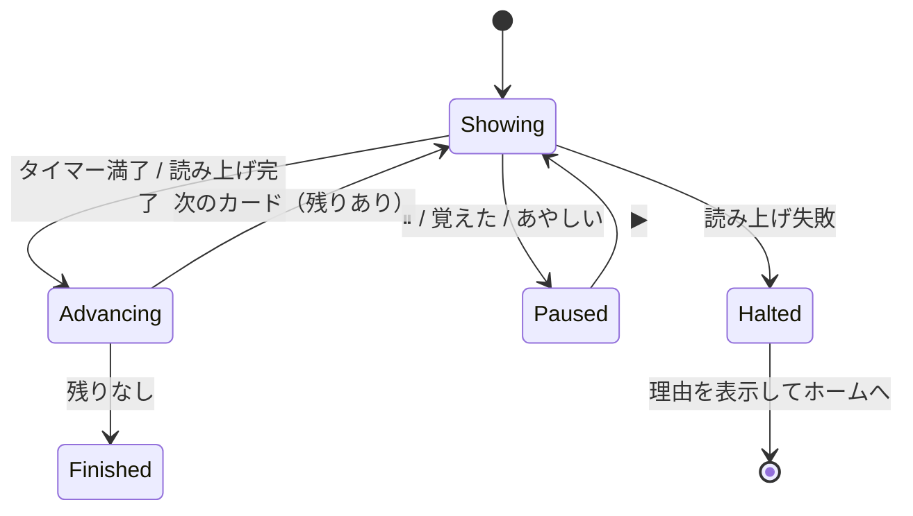

# フラッシュカードモード（Flashcard Mode）

対応要件: FR-24〜FR-26, NFR-10
実装: `ui/screens/flashcard_screen.dart`, `application/flashcard_controller.dart`

## 1. 3つの送り方

上下の言語配置と送りの契機がセットで決まる。設定 > 学習で選び、モード選択シートでも切り替えられる。

| id | 名称 | 上段 | 下段 | 送りの契機 |
|---|---|---|---|---|
| `silentAuto` | 無音・自動送り | 日本語 | 英語 | 設定した秒数の経過（2/3/5/8秒） |
| `speakEn` | 英語を聞いて送る | 英語 | 日本語 | 英語の読み上げ完了 |
| `speakJa` | 日本語を聞いて送る | 日本語 | 英語 | 日本語の読み上げ完了 |

- 上下の配置は送り方ごとに固定する。**上段＝先に意識させたい言語**という一貫した意味を持たせる。
  `speakEn` は音と綴りを結び付けるので英語が上、`speakJa` と `silentAuto` は
  意味から英語を引き出させるので日本語が上になる。
- カードは表裏を持たない。上下を同時に表示する。めくる操作を挟むと、
  「次々に流して浴びる」というこのモードの目的が損なわれる。

## 2. 送りの制御

- `silentAuto` は `Ticker` で残り時間バーを描き、満了で送る。
- `speakEn` / `speakJa` は `TtsService.speak()` の完了を待って送る。
  **固定秒のタイマーで代用しない**。語の長さで読み上げ時間が変わるため、
  タイマーだと長い語が途中で切れ、短い語で無駄に待つ。
- 読み上げが失敗したら送りを止め（`Halted`）、理由を SnackBar で示してセッションを終える。
  無音のまま自動送りを続けない。
- 「戻る ◀」「進む ▶」で手動移動できる。手動移動すると自動送りは一時停止する
  （ユーザーが操作した以上、勝手に流し始めない）。
- 学習中は `wakelock_plus` で画面を点けたままにする（NFR-10）。画面を離れたら必ず解除する。

## 3. 自己評価

カード下部に「覚えた」「あやしい」の2ボタンを置く。

| 操作 | 効果 |
|---|---|
| 覚えた | grade 4 で `word_reviews` を更新。次のカードへ即座に送る |
| あやしい | grade 2 で `word_reviews` を更新。次のカードへ即座に送る |
| 何も押さない | `word_reviews` を更新しない。`learning_logs` にも記録しない |

- 押さずに流れた語は「見ただけ」であり、学習状態を動かさない（FR-26）。
  眺めただけの語がマスター判定に入ると、統計が実態から離れる。
- ただし `daily_stats.answeredCount` にも計上しない。デイリー目標は
  「自分で判断した回数」で数える。眺めた枚数で目標が埋まると、目標が意味を失う。
- 結果画面には「表示 40枚 / 評価 12枚（覚えた 9・あやしい 3）」と両方を出す。

## 4. 出題キュー

[srs_scheduler.md] §6 と同じ `StudyQueueBuilder` を使う。
ただしフラッシュカードは流し見が目的なので、問題数の選択肢に「全部」を含め、
既定を 50 枚にする（他モードは 20）。

## 5. 記録

自己評価を押したときだけ、1トランザクションで次を書く。

| テーブル | 内容 |
|---|---|
| `learning_logs` | mode=`flashcard`, direction=送り方に対応, isCorrect=(grade>=3), grade, elapsedMs=カード表示時間 |
| `word_reviews` | `Sm2Scheduler.apply` の結果 |
| `daily_stats` | `answeredCount` +1 ほか |
| `study_sessions` | 加算 |

`study_sessions.plannedCount` は表示予定枚数、`answeredCount` は評価した枚数になる。
この2つが一致しないのはこのモードだけなので、結果画面の文言で明示する。

## 6. テスト観点

- `speakEn` で `speak` の完了 Future が解決するまで次のカードへ進まない。
- `speak` が例外を投げたら送りが止まり、セッションが `Halted` になる。
- `silentAuto` で設定秒数どおりに送られる（`FakeAsync` で検証）。
- 手動で「進む」を押すと自動送りが一時停止する。
- 自己評価を押さずに流したカードが `learning_logs` にも `daily_stats` にも入らない。
- 画面を離れると `wakelock` が解除される。
- 上下の言語配置が3モードそれぞれで表のとおりになる。
