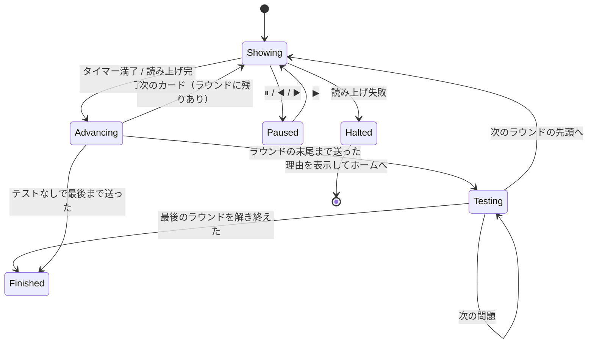

# フラッシュカードモード（Flashcard Mode）

対応要件: FR-24〜FR-26, FR-113, NFR-10
実装: `ui/screens/flashcard_screen.dart`, `application/flashcard_controller.dart`

## 0. このモードが何をするか

**「何枚か流し見して浴びる → いま見た語を覚えているか確かめる」を繰り返す。**

流し見だけのモードは成立しない。眺めている間は誰でも「分かった気」になるので、
浴びた枚数が増えても、覚えたかどうかは本人にも分からないままになる。
確かめる場面を挟んで、はじめて枚数と成績が意味を持つ。

## 1. 3つの送り方

上下の言語配置と送りの契機がセットで決まる。設定 > 学習で選び、モード選択シートでも切り替えられる。

| id | 名称 | 上段 | 下段 | 送りの契機 |
|---|---|---|---|---|
| `silentAuto` | 無音・自動送り | 日本語 | 英語 | 設定した秒数の経過（2/3/5/8秒） |
| `speakEn` | 英語を聞いて送る | 英語 | 日本語 | 英語の読み上げ完了 |
| `speakJa` | 日本語を聞いて送る | 日本語 | 英語 | 日本語の読み上げ完了 |

- 上下の配置は送り方ごとに固定する。**上段＝先に意識させたい言語**という一貫した意味を持たせる。
  `speakEn` は音と綴りを結び付けるので英語が上、`speakJa` と `silentAuto` は
  意味から英語を引き出させるので日本語が上になる。
- カードは表裏を持たない。上下を同時に表示する。めくる操作を挟むと、
  「次々に流して浴びる」というこのモードの目的が損なわれる。

## 2. 送りの制御

- `silentAuto` は `Ticker` で残り時間バーを描き、満了で送る。
- `speakEn` / `speakJa` は `PronunciationService.speakWord()` の完了を待って送る。
  音声ファイルで鳴るか合成音声で鳴るかは `PronunciationService` が決めるので、
  この画面は音源を意識しない（[pronunciation.md] §6）。
  **固定秒のタイマーで代用しない**。語の長さで再生時間が変わるため、
  タイマーだと長い語が途中で切れ、短い語で無駄に待つ。
- 再生が失敗したら送りを止め（`Halted`）、理由を SnackBar で示してセッションを終える。
  無音のまま自動送りを続けない。**別の音源に切り替えて続行もしない**（[pronunciation.md] §2.2）。
- 「戻る ◀」「進む ▶」で手動移動できる。手動移動すると自動送りは一時停止する
  （ユーザーが操作した以上、勝手に流し始めない）。
- **手動移動はラウンドの中だけ**にする。ラウンドをまたいで動けると、確認テストの対象が
  「そのラウンドで見せた語」でなくなり、何を確かめているのかが崩れる。
- 学習中は `wakelock_plus` で画面を点けたままにする（NFR-10）。画面を離れたら必ず解除する。

## 3. ラウンドと確認テスト（FR-113）

`profiles.flashcardRoundSize` 枚を流し見するごとに、**そのラウンドで見せた語だけ**を
確認テストで問う。形式は `profiles.flashcardTestFormat` で選ぶ。

| id | 形式 | 中身 |
|---|---|---|
| `choice` | 4択（既定） | [quiz_mode.md] と同じ描画・同じ誤答選択肢の選び方 |
| `spell` | スペル | [spell_mode.md] と同じ判定・同じ入力（方向は `jaToEn` 固定） |
| `none` | テストなし | 確認テストを挟まず、最後まで流し続ける |

- ラウンドの長さは 5 / 10 / 20 枚（既定 10）。**最後にまとめて全部を問う形にはしない。**
  50枚を浴びてから50問を問うと、最初のほうの語はもう記憶に残っておらず、
  「覚えたか」ではなく「どれだけ前か」を測ってしまう。
- 逆に1枚ごとに問うと、4択モードやスペルモードとほぼ同じものになり、
  「流して浴びる」というこのモードの持ち味が消える。ラウンドはその中間を取る。
- 最後のラウンドは半端な枚数になる。そのぶんだけ問う（枚数を揃えるために
  前のラウンドの語を混ぜない）。
- 4択で選択肢が4つ揃わない語は**飛ばす**（ダミー文字列で埋めない。FR-29 と同じ扱い）。
  そのラウンドで1問も作れなかったときは、テストを挟まずに次のラウンドへ送る。
- `none` を残すのは、意味を思い出す前の「まず浴びたい」段階に使い道があるため。
  ただしこのとき成績は付かない（§8）。

### 3.1 出題の向き

確認テストの向きは**流し見の上下配置に合わせる**（§1 の「上段＝先に意識させたい言語」）。

| 送り方 | 上段 | 4択の向き |
|---|---|---|
| `speakEn` | 英語 | `enToJa`（英語を見て意味を選ぶ） |
| `speakJa` / `silentAuto` | 日本語 | `jaToEn`（意味を見て英語を選ぶ） |

`profiles.choiceDirection` は使わない。4択モードの設定を変えたらフラッシュカードの
向きまで変わる、という繋がり方は筋が悪い。

## 4. 自己評価は持たない

以前は「覚えた」「あやしい」の2ボタンで自己申告する形だったが、**廃止した**。

- 押す前に自動でカードが送られてしまうため、押せた語と押せなかった語が
  操作の速さで決まる。成績として信用できない。
- 確認テストが「覚えたか」を判定する以上、主観の自己申告と客観のテスト結果が
  二重になり、結果画面のどの数字が何を表すのかがぼやける。

流し見の最中は**何も記録しない**。眺めただけの語が学習状態を動かすと、
統計が実態から離れる（FR-26）。

## 5. 出題キュー

[srs_scheduler.md] §6 と同じ `StudyQueueBuilder` を使う。
ただしフラッシュカードは流し見が目的なので、問題数の選択肢に「全部」を含め、
既定を 50 枚にする（他モードは 20）。

4択の誤答選択肢を組む候補プールは、セッション開始時に一度だけ読む。
ラウンドの切れ目で DB を待たせない。

## 6. 記録

**確認テストを解いたときだけ**、1トランザクションで次を書く。

| テーブル | 内容 |
|---|---|
| `learning_logs` | mode=`flashcard`, direction=§3.1 の向き, isCorrect, grade, elapsedMs=**テスト1問の解答時間** |
| `word_reviews` | `Sm2Scheduler.apply` の結果 |
| `daily_stats` | `answeredCount` +1 ほか |
| `study_sessions` | 加算 |

- `mode` は形式に関わらず `flashcard`。統計上はフラッシュカードの成績として扱う
  （どの形式で確かめたかは、モードの成績を分けるほどの違いではない）。
- `grade` はフラッシュカード専用の解決を持たず、**その形式の入口をそのまま使う**
  （4択は `GradeResolver.forChoice`、スペルは `GradeResolver.forSpell`）。
  確かめ方が同じなら、どの画面から入ったかで難易度の解釈が変わる理由が無い。
- `elapsedMs` は流し見の表示時間ではなく、テスト1問の解答時間。
  流し見の秒数は設定で決まるので、記録しても学習の速さを表さない。
- `study_sessions.plannedCount` は流し見の予定枚数、`answeredCount` はテストで解いた
  問題数になる。この2つが一致しないのはこのモードだけなので、結果画面の文言で明示する（§8）。

## 7. XP

確認テストの正解に、**テストの形式に対応する係数**で XP を付ける
（4択なら ×1.0、スペルなら ×1.5。[gamification.md] §3）。

`AnswerRecord.xpMode` に形式のモードを渡し、`mode` とは別に扱う。
産出の負荷に応じて点が変わるという既存の考え方を、フラッシュカードの中でも通すため。
綴らせておいて4択と同じ点、では釣り合わない。

流し見だけ（`none`）では解答が無いので XP も付かない。

## 8. 結果画面

| テスト形式 | 出すもの |
|---|---|
| `choice` / `spell` | 正解率のリング ＋ 「N / M 問正解」 ＋ 「流し見 50枚 ／ 確認テスト 48問」 |
| `none` | 「流し見 50枚」と、成績が付かない理由。**正解率も問題数も出さない** |

`none` で「0%」や「0 / 0 問正解」を出すと、悪い成績が付いたように見える。
1問も解いていないのだから、成績の欄そのものを出さないのが実態に合う。

## 9. テスト観点

- `speakEn` で `speakWord` の完了 Future が解決するまで次のカードへ進まない
  （音声ファイル・合成音声のどちらでも同じ）。
- `speakWord` が例外を投げたら送りが止まり、セッションが `Halted` になる。
- `silentAuto` で設定秒数どおりに送られる（`FakeAsync` で検証）。
- 手動で「進む」を押すと自動送りが一時停止する。
- ラウンドの末尾まで送ると `Testing` に入り、**そのラウンドで見せた語だけ**が出題される。
- 最後のラウンドが半端な枚数（8語をラウンド3 → 最後は2枚）でも確認テストが出る。
- `none` では `Testing` を一度も通らず、`learning_logs` / `word_reviews` /
  `daily_stats` が空のまま終わる。
- 流し見の間は1件も記録されず、テストを解いた時点で `learning_logs` が1件増える。
- スペル形式の判定が `SpellJudge` と一致する。
- v2 → v3 の移行で、既存の学習者に `choice` / 10枚 が入る。
- 画面を離れると `wakelock` が解除される。
- 上下の言語配置が3モードそれぞれで §1 の表のとおりになる。
