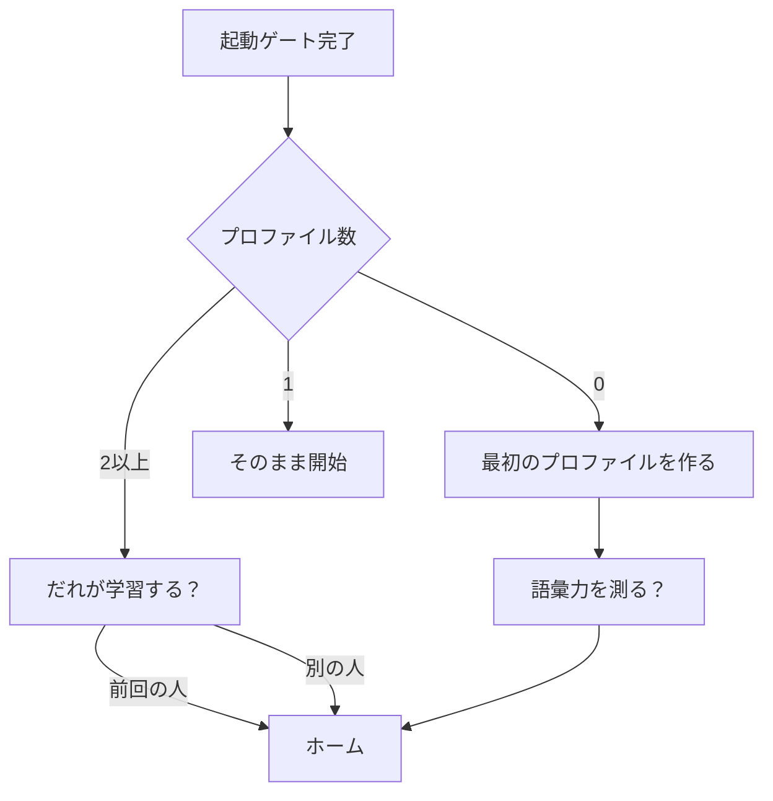

# 学習プロファイル（Profiles）

対応要件: FR-58〜FR-64
実装: `data/database/tables/profiles.dart`, `ui/screens/profile_gate_screen.dart`,
`ui/screens/profiles_screen.dart`, `providers/active_profile.dart`

## 1. 位置づけ

1台の端末を複数人（兄弟・親子）で使うことを前提にする。
**単語そのものは全員で共有し、学習の記録だけを人ごとに分ける。**

| 共有するもの | プロファイル別に持つもの |
|---|---|
| `wordbooks` / `words` / `wordbook_entries` | `word_reviews`（学習状態） |
| 語のつくり・派生語ファミリー | `learning_logs` / `study_sessions` |
| 音声パック（`audio_packs` / `word_audios`） | どのパックを使うか・音源の優先順位 |
| | `daily_stats`（目標・ストリーク） |
| | `achievements`（実績） |
| | `vocab_size_tests`（語彙力測定の履歴） |
| | 学習設定・表示設定（`profiles` の列） |
| | マイ単語（`words.ownerProfileId`） |

単語マスタを分けないのは、同じ `apple` を人数分だけ複製すると、
語のつくりや派生語の紐付けも人数分になり、単語帳の編集がプロファイルごとにずれるため。

## 2. `profiles` テーブル

学習設定と表示設定は、`SharedPreferences` ではなくこのテーブルの列に持つ。
プロファイルを切り替えたら、設定も一緒に切り替わる必要があるため。

| 列 | 型 | 既定 | 説明 |
|---|---|---|---|
| `id` | int | | PK |
| `name` | text | | 表示名（例「たろう」） |
| `emoji` | text | `🙂` | アバター代わり |
| `colorSeed` | int | | 識別色 |
| `palette` | text | `pink` | テーマ配色。人ごとに変えられる |
| `textScale` | text | `medium` | 小 / 中 / 大 |
| `density` | text | `standard` | 標準 / コンパクト |
| `dailyGoal` | int | 20 | デイリー目標 |
| `sessionSize` | int | 20 | 1セッションの問題数 |
| `keyboardLayout` | text | `qwerty` | qwerty / abc |
| `autoNextOnCorrect` | bool | false | 正解したら自動で次へ |
| `flashcardMode` | text | `silentAuto` | 送り方 |
| `flashcardSeconds` | int | 3 | |
| `choiceDirection` | text | `random` | |
| `speedLimitMs` | int | 3000 | スピードモードの制限時間 |
| `selectedWordbookIds` | text | `[]` | 学習対象の単語帳（JSON配列） |
| `audioSource` | text | `fileFirst` | 音源の優先順位（[pronunciation.md] §2） |
| `audioPackIds` | text | `[]` | 使用する音声パック（JSON配列。優先順） |
| `ttsEnVoice` / `ttsJaVoice` | text | 空 | |
| `ttsRate` / `ttsPitch` | real | 0.5 / 1.0 | |
| `reminderEnabled` | bool | false | 学習リマインダー |
| `reminderHour` / `reminderMinute` | int | 19 / 0 | |
| `searchExamples` | bool | false | 辞書で例文も検索する |
| `dictViewMode` / `dictGridColumns` | text | `list` / `auto` | |
| `createdAt` / `updatedAt` | datetime | | |

`SharedPreferences` に残すのは端末レベルの値だけにする。

| キー | 説明 |
|---|---|
| `profile.lastActiveId` | 前回使ったプロファイル |
| `seed.installedVersion` | プリセットの投入済み版（端末に1つ） |

## 3. プロファイル別テーブルの主キー

| テーブル | 主キー |
|---|---|
| `word_reviews` | `(profileId, wordId)` |
| `daily_stats` | `(profileId, studyDate)` |
| `achievements` | `(profileId, code)` |
| `learning_logs` | `id`（`profileId` にインデックス） |
| `study_sessions` | `id`（`profileId` にインデックス） |
| `vocab_size_tests` | `id`（`profileId` にインデックス） |

`profiles` の削除は、これらを cascade で消す。確認ダイアログに消える件数を出す。

## 4. 起動時の選択（プロファイルゲート）

- プロファイルが2人以上のときだけ選択画面を出す。1人なら余計な操作を挟まない。
- 選択画面は絵文字＋名前の大きなカードを縦に並べる。前回使った人を先頭に置き、
  「前回」のキャプションを添える。
- **PIN やパスワードは設けない**。家庭内での利用を想定しており、
  弟が兄のプロファイルを開いてしまう程度の事故は、切り替えの手軽さと引き換えにする。
  誤って別人で学習した分は、履歴画面から手動で削除できるようにする（§6）。
- 新規作成の直後に語彙力測定（[vocab_size_test.md]）を案内する。
  ここで測ると、その人のレベルに合った単語帳が最初から提案される。断ることもできる。

## 5. 切り替え

- 設定 > 情報の先頭ではなく、**ホーム右上のアバター**をタップして切り替える。
  学習中は切り替えられない（セッションを中断してから切り替える）。
- 切り替えると `AppColors.setActive` が新しいプロファイルの配色に変わり、
  ルートが `KeyedSubtree(key: ValueKey('${profile.id}:${palette.id}'))` で作り直される。
  配色だけでなくプロファイル id もキーに含めるのは、
  同じ配色の別人へ切り替えたときに古い状態が残らないようにするため。
- 切り替え時に TTS を停止し、進行中のタイマー（フラッシュカード・スピード）を破棄する。

## 6. 管理（設定 > マスタ > 学習者）

[STYLE_GUIDE §4.1] のマスタ管理画面の型。

- 行 = 絵文字サムネ ｜ 名前＋caption「学習中 312語 ・ ストリーク 7日」｜ 現在のプロファイルにチェック ｜ 削除。
- 行タップ = 編集シート（名前・絵文字・色）。
- FAB = 追加。
- **最後の1人は削除できない**。削除しようとしたら「学習者は1人以上必要です」を出す。
- 削除は `confirmDestructive`。「たろうさんの学習記録 3,214件がすべて消えます」と件数を明記する。
  マイ単語（`ownerProfileId` が一致する語）も一緒に消える旨を書く。
- 「別の学習者に付け替える」は用意しない。誤操作の救済としては、
  削除前にその人の JSON エクスポートを促す導線を同じダイアログに置く。

## 7. 集計とプロファイル

- ホーム・統計・ストリーク・実績は、すべて**現在のプロファイル**のデータだけを見る。
- 辞書の一覧は共有の単語 ＋ 自分のマイ単語（[my_words.md] §3）。他人のマイ単語は出さない。
- 単語詳細の学習状態カードは現在のプロファイルのもの。
  他の人の状態は表示しない（比べさせない）。

## 8. テスト観点

- プロファイルAで解いた結果が、プロファイルBの `word_reviews` に影響しない。
- 同じ `wordId` に対して2人分の `word_reviews` が独立して存在できる。
- プロファイル切替で配色・文字サイズ・デイリー目標・選択中の単語帳が切り替わる。
- プロファイル削除で、その人の学習記録とマイ単語だけが消え、共有の単語は残る。
- 最後の1人が削除できない。
- プロファイルが1人のとき、起動時に選択画面が出ない。
- 学習セッション中に切り替えようとすると中断確認が出る。
