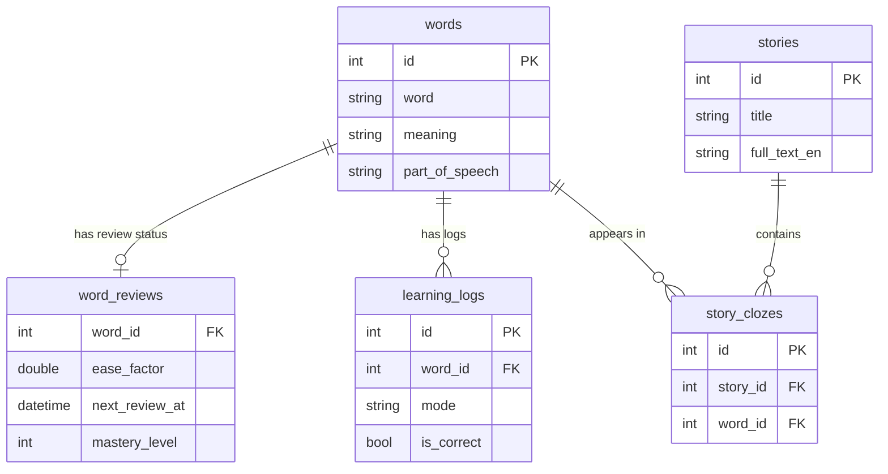

# Encello - データモデル設計書 (Data Model & Database Schema)

## 1. データベース概要
本アプリでは `drift` (SQLite) を使用して、オフライン環境下で全ての単語データ、学習ログ、ストーリーデータを構造化して管理します。

---

## 2. テーブル仕様 (Drift Table Definitions)

### 2.1 `words` (単語マスターテーブル)
単語の基本情報を保持します。

| カラム名 | 型 | 制約 | 説明 |
|---|---|---|---|
| `id` | Int | Primary Key, AutoIncrement | 単語ID |
| `word` | Text | Not Null, Index | 英単語 (例: "apple") |
| `phonetic` | Text | Nullable | 発音記号 (例: "/ˈæp.əl/") |
| `meaning` | Text | Not Null | 日本語訳 (例: "りんご") |
| `part_of_speech` | Text | Not Null | 品詞 (noun, verb, adjective 等) |
| `example_sentence` | Text | Nullable | 英語例文 |
| `example_translation` | Text | Nullable | 例文の日本語訳 |
| `difficulty_level` | Int | Default(1) | 難易度レベル (1: 初級, 2: 中級, 3: 上級) |
| `category` | Text | Default('general') | カテゴリ・単語帳タグ (例: "TOEIC", "Basic") |
| `created_at` | DateTime | Default(currentDate) | 登録日時 |
| `updated_at` | DateTime | Default(currentDate) | 更新日時 |

---

### 2.2 `word_reviews` (復習・忘却曲線ステータステーブル)
各単語のユーザーごとの定着度・忘却曲線スケジュール情報を保持します。

| カラム名 | 型 | 制約 | 説明 |
|---|---|---|---|
| `word_id` | Int | Primary Key, Foreign Key -> `words.id` | 対象単語ID |
| `repetition_count` | Int | Default(0) | 連続正解・復習回数 |
| `interval_days` | Double | Default(0.0) | 現在の復習間隔（日数） |
| `ease_factor` | Double | Default(2.5) | 難易度係数 (SM-2 Ease Factor, 初期値2.5) |
| `next_review_at` | DateTime | Not Null, Index | 次回復習予定日時 |
| `last_reviewed_at` | DateTime | Nullable | 最終復習日時 |
| `mastery_level` | Int | Default(0) | 習熟度 (0: 未学習, 1: 習得中, 2: 定着, 3: 完全マスター) |
| `total_correct` | Int | Default(0) | 通算正解数 |
| `total_incorrect` | Int | Default(0) | 通算不正解数 |

---

### 2.3 `learning_logs` (学習履歴ログテーブル)
学習セッションごと・回答ごとの詳細ログを保持します。

| カラム名 | 型 | 制約 | 説明 |
|---|---|---|---|
| `id` | Int | Primary Key, AutoIncrement | ログID |
| `word_id` | Int | Foreign Key -> `words.id` | 解答した単語ID |
| `mode` | Text | Not Null | 学習モード (`spell`, `flashcard`, `story_cloze`) |
| `is_correct` | Bool | Not Null | 正解したかどうか |
| `answered_text` | Text | Nullable | ユーザーが入力・選択した文字列 |
| `elapsed_ms` | Int | Default(0) | 解答にかかった時間（ミリ秒） |
| `evaluated_at` | DateTime | Default(currentDate) | 学習実行日時 |

---

### 2.4 `stories` (ストーリーマスターテーブル)
ストーリー穴埋め学習（Cloze Stories）用の長文・物語データを保持します。

| カラム名 | 型 | 制約 | 説明 |
|---|---|---|---|
| `id` | Int | Primary Key, AutoIncrement | ストーリーID |
| `title` | Text | Not Null | ストーリータイトル（英語） |
| `title_ja` | Text | Not Null | ストーリータイトル（日本語） |
| `category` | Text | Default('fairytale') | カテゴリ (童話, ニュース, 日常会話) |
| `full_text_en` | Text | Not Null | 全文テキスト (英語) |
| `full_text_ja` | Text | Not Null | 全文テキスト (日本語訳) |
| `difficulty_level` | Int | Default(1) | 難易度 |
| `created_at` | DateTime | Default(currentDate) | 登録日時 |

---

### 2.5 `story_clozes` (ストーリー空欄データ)
ストーリー内の穴埋め問題箇所とターゲット単語の紐付け。

| カラム名 | 型 | 制約 | 説明 |
|---|---|---|---|
| `id` | Int | Primary Key, AutoIncrement | ID |
| `story_id` | Int | Foreign Key -> `stories.id` | 属するストーリーID |
| `word_id` | Int | Foreign Key -> `words.id` | ターゲット単語ID |
| `char_start_index` | Int | Not Null | ストーリー本文中での開始文字位置 |
| `char_end_index` | Int | Not Null | ストーリー本文中での終了文字位置 |
| `hint` | Text | Nullable | ヒントテキスト |

---

### 2.6 `user_settings` (ユーザー設定テーブル)
キーバリュー型または1行固定の設定レコード。

| カラム名 | 型 | 制約 | 説明 |
|---|---|---|---|
| `key` | Text | Primary Key | 設定キー (例: `daily_goal`, `tts_speed`, `theme_mode`) |
| `value` | Text | Not Null | 設定値 (文字列化) |

---

## 3. リレーションシップ Diagram (Mermaid)

