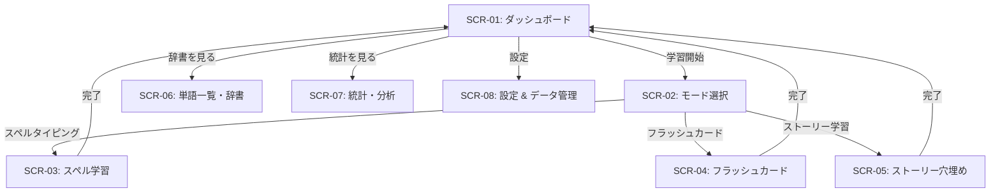

# Encello - 画面設計 & UIフロー (Screens & Flow)

## 1. 画面一覧 (Screen Inventory)

| 画面ID | 画面名称 | 主な機能・役割 |
|---|---|---|
| `SCR-01` | **ダッシュボード (Home)** | 今日の学習目標進捗、復習バッジ、クイックスタートボタン、連続学習ストリーク |
| `SCR-02` | **学習モード選択 (Mode Select)** | スペル学習、フラッシュカード、ストーリー学習の選択画面 |
| `SCR-03` | **スペル学習 (Spell Mode)** | 単語の日本語訳とヒント表示、キーボードタイピング、類似度フィードバック、音声自動再生 |
| `SCR-04` | **フラッシュカード (Flashcard Mode)** | カードめくり/4択切り替え、自己評価ボタン（Again/Hard/Good/Easy） |
| `SCR-05` | **ストーリー穴埋め (Story Cloze Mode)** | 英文ストーリーの対話的閲覧、穴埋め回答、段落和訳トグル |
| `SCR-06` | **単語一覧・辞書 (Dictionary)** | 全単語の検索・絞り込みフィルタ・詳細ダイアログ・単語追加編集 |
| `SCR-07` | **統計・学習分析 (Stats)** | 習熟度別パイチャート、週間学習グラフ、苦手単語一覧 |
| `SCR-08` | **設定 & データ管理 (Settings)** | バックアップ・リストア (CSV/JSON)、TTS音声設定、テーマ切り替え |

---

## 2. 画面遷移フロー (Navigation Flow)

---

## 3. 主要画面レイアウト設計

### 3.1 ダッシュボード (SCR-01)
- **Header**: Encello ロゴ + 今日のストリーク火の玉アイコン 🔥 + 設定アイコン
- **Goal Progress Card**: 円形プログレスバー（例: 15/20 単語完了）。「復習を開始する」大ボタン
- **Quick Modes Grid**:
  - スペルタイピング Card
  - フラッシュカード Card
  - ストーリー学習 Card
- **Recent Stats Summary**: 直近の正解率と習得単語数

### 3.2 スペル学習画面 (SCR-03)
- **Top Bar**: 進捗インジケータ (例: 3/10) + 中断ボタン
- **Word Prompt Card**:
  - 日本語訳（例: "りんご"）
  - 品詞バッジ（例: `[名詞]`）
  - 例文プレースホルダー
- **Input Field / Custom Keyboard**:
  - 文字タイル表示（空欄 `_ _ _ _ _`）
  - インタラクティブ・キーボード
- **Feedback Overlay**:
  - 正解時: グリーンエフェクト + 音声再生 + 「Next」自動進行
  - 惜しい時: オレンジエフェクト + 「1文字違います (例: aple)」ヒント

### 3.3 ストーリー穴埋め画面 (SCR-05)
- **Story Reader Area**:
  - スクローラブな英文テキスト
  - 空欄 `[ ??? ]` をハイライト表示
- **Interactive Quiz Sheet**:
  - 空欄をタップすると下部からモーダルがせり上がり、選択肢またはスペル入力フィールドを提供
  - 段落ごとの日本語訳表示トグル
